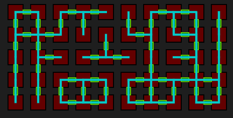
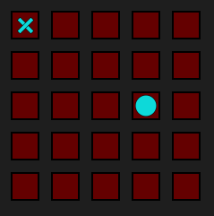
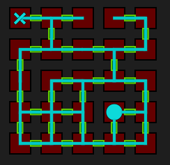
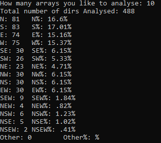

  

<h1 align="center" style="text-align: center;"> Compression Algorithm / Visulisation Of Large Data </h1>

  

## Project Overview:
<strong>The Game Idea:</strong>
the player would navigate through a level that would consist of 2 or more rooms, each room would be a sqaure and therefore have a possibility of 4 different pathways from each room.

Example of 5 x 5 Level:

The level would have a start and finish where the player would then complete that level.
The levels should be randomly generated and always have a start and finish that are connected by atleast 1 route.

## Visulisation:

My Visualisation Script:  <a  href="p5.js Script/index.html" target="_blank">P5.JS Sketch</a> <a href="p5.js Script/Compressed Codes.txt" target="_blank"> Level Codes</a>

The need to visulise these levels arose when creating these strings, as they were hard to visulise from looking at the directions given in the strings.

## Compression:
<strong> Basics of an Uncompressed level string:</strong>
|Path Directions|     Width|Height|
|:---:|:-----------------------:|:----:|
|SE,SE,SE,E,NE,SE,E,W,S,NE,SE,E,W,W,NW S,NS,E,W,NW,W,N,S,W,NW   |,05|     ,05|

<strong> Basics of an Compressed level string:</strong>
|Width|     Path Directions     |Height|
|:---:|:-----------------------:|:----:|
|5    |EEECGECDBGECDDHBICDHDABDH|     5|

Uncompressed code = SE,SE,SE,E,NE,SE,E,W,S,NE,SE,E,W,W,NW S,NS,E,W,NW,W,N,S,W,NW,05,05

Compressed code = 5EEECGECDBGECDDHBICDHDABDH5

### Compressing Reduction %:
<strong> Basics of our compression algorithm</strong>
1 room can have 4 possible paths connected, this gives a possibility of 256 connections that 1 room can have.

The program that was responsible for generating the level codes was adapted to generate a number of levels and giving feedback on the percentage of how often any given possibility shows up.

From this data we were able to identify the most common combinations of paths and from these, assign these combinations to letters ranging from A-O
For example:
a level code contains a room with NW meaning that this room has a path on the North and West face, this combination would be reduced to just H.

<strong> Example </strong>:
Uncompressed code = SE,SE,SE,E,NE,SE,E,W,S,NE,SE,E,W,W,NW S,NS,E,W,NW,W,N,S,W,NW,05,05

Compressed code = 5EEECGECDBGECDDHBICDHDABDH5

  "A" - "N" 
"B" - "S" 
"C" - "E" 
"D" - "W" 
"E" - "SE" 
"F" - "SW" 
"G" - "NE" 
"H" - "NW" 
"I" - "NS" 
"J" - "EW" 
"K" - "SEW" 
"L" - "NEW" 
"M" - "NSW" 
"N" - "NSE" 
"O" - "NSEW" 

### Reduction
<strong>For a 5 x 5 level</strong>
11.5 Characters were reduced or 29.3%
Reducing the "," --- 34 Characters were reduced or 55.7%
<strong>For a 10 x 10 level</strong>
30 Characters were reduced or 22.1%
Reducing the "," --- 140 Characters were reduced or 57.3%
<strong>For a 50 x 50 level</strong>
817 Characters were reduced or 24.5%
Reducing the "," --- 3322 Characters were reduced or 57.0%
